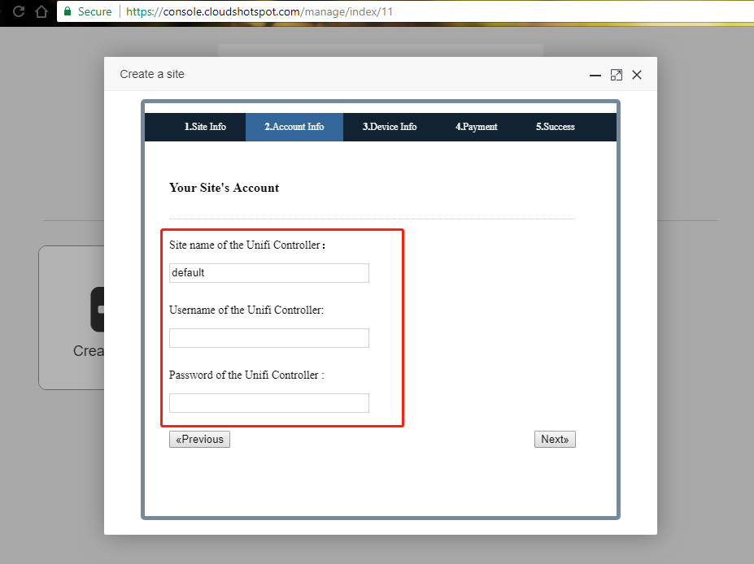

#对接Ubiquiti Network - Hotspot Portal

登录控制台
https://console.cloudshotspot.com

###1.创建站点：

成功登录后,点击创建站点。

###2.站点信息:

品牌类型:选择Ubiquiti 

输入相应的信息
Unifi Controller地址：输入IP或域名都可以

跳转URL:输入认证完成后的跳转的URL网址

然后选择下一步.

###3.账号信息

说明：这里的用户与密码在配置hotspot时要一致

###4.设备信息

物理设备:就是MAC地址,就是服务Hotspot的接口

区域位置:服务器所在的地理位置,选择一个最接近的

###5.选择套餐

在这里选择免费

###6.配置信息

在这一步骤,说明已经创建站点完成. 

下载站点生成的hotspot模板ZIP文件,上传至RouterOS中

复制配置信息，粘贴到路由器中

