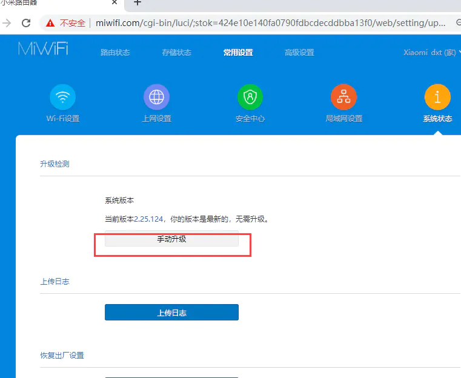
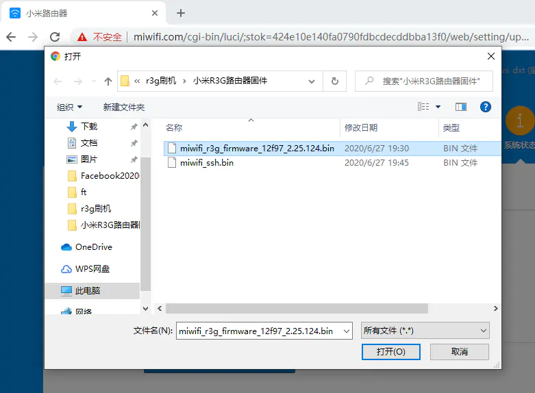
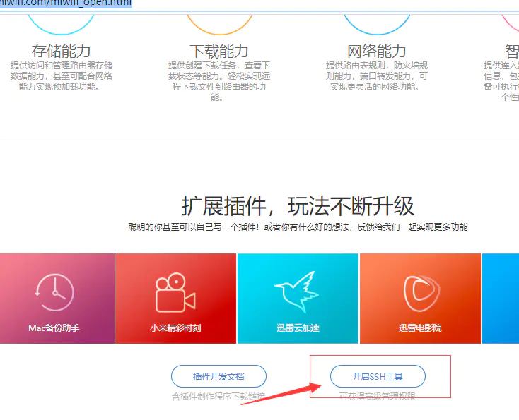
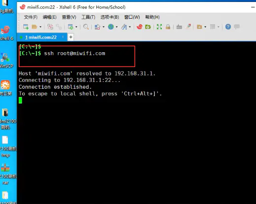

# XIAOMI R3G HARDWARE CONFIGURATION

Processor Chip：MT7621A MIPS dual-core 880MHz

DRAM MEMORY: 256MB DDR3-1200

Flash:128MB SLC Nand Flash

Wi-Fi Chips：7612EN & 7603EN

Interface：1 USB 2.0 port

Wireless rate: 2.4G:300Mbps,5G:867Mbps

##R3G ROUTER BRUSH MAIN PROCESS:：

	1. Setup the router and install a dev firmware

	2. Downloading  tool kit for SSH

	3. Format a USB drive with FAT / FAT32 and copy the downloaded miwifi_ssh.bin to it.

	4. Put USB drive in to the Router for turn on the SSH 

	5. Login to the router using SSH

	6. Get Cloud-Hotspot Firmware and Install it

 

##Upgrade the development firmware

###1.CONNECT THE R3G ROUTER WITH A COMPUTER TO ENSURE THAT THE COMPUTER AND THE ROUTER ARE INTEROPERABLE

###2. Open the browser to enter the router's domain name miwifi.com or the router's ip address, into the management page

 

###3. GO TO XIAOMI ROUTER'S OFFICIAL WEBSITE TO DOWNLOAD THE R3G DEVELOPMENT FIRMWARE

[http://www1.miwifi.com/miwifi_download.html](https://links.jianshu.com/go?to=http%3A%2F%2Fwww1.miwifi.com%2Fmiwifi_download.html)

###4. Click on the system upgrade in the router management page, enter the upgrade interface, and then select the downloaded firmware for the upgrade

###5.Download the ssh kit

after upgrading the development version of the firmware that ssh service is disable, we need to go to xiaomi official website to download ssh kit

open xiaomi's official website to enter the open platform center 

[http://www1.miwifi.com/miwifi_open.html](https://links.jianshu.com/go?to=http%3A%2F%2Fwww1.miwifi.com%2Fmiwifi_open.html)

sign in with a xiaomi account bound to a xiaomi router

here need to log in to bind xiaomi router xiaomi account, log in to view their router's ssh root password, this page also has the detailed steps to open ssh, you can follow the step by step

click to download the kit

	
	Setup the router and install a dev firmware, for example cdn.cnbj1.fds.api.mi-img.com/xiaoqiang/rom/r3g/miwifi_r3g_firmware_12f97_2.25.124.bin
	Install the Mi Wi-Fi app on a phone or tablet. (Android | there is also an iOS app)
	Open the app and connect your router. Also sign in to link that router to your account. The router should be detected assuming you are connected to its WiFi and the router is connected to the internet. It might also work without that. You also might get an error message when trying to connect the router stating that the device is no Mi Router. In that case using an older version of the app from pages like https://apkmirror.com will probably help.
	On a PC, visit https://d.miwifi.com/rom/ssh and sign-in to your account. It is important to have the https version. It might get switched to http and show an error. Changing that to https again should make the page load again. This is also the case for all clicks on that website, for example the download link will also probably only work if changing manually to https after getting an error. Alternatively, redirection and loading problems can be avoided by directly accessing the page. After signing-in to your xiaomi account get your “userID” (the number near your profile pic), then copy-paste it to the following link https://d.miwifi.com/rom/ssh?userId=<yourUserID>.
	After login, a page with your router, root password for SSH access and a download button should be displayed. Press the download button to download the miwifi_ssh.bin file. If loading/redirection problems still persist, copy the download link (button on the right of the popup dialog) and visit it after adding “&userId=<yourUserID>”.
	Format a USB drive with FAT / FAT32 and copy the downloaded miwifi_ssh.bin to it.
	Shut down the router (unplug it) and put the USB drive in. Now you have to hold down the reset button of the router (use a paper-clip for example) while powering the router on (plugging the power cable in). Continue holding the button until you see the yellow LED start to flash. This might take a while (about 15 seconds). Now you can release the button. The router will reboot soon. Afterwards you should have SSH access.
	Login to the router using SSH with root as username and the root password that is displayed on https://d.miwifi.com/rom/ssh.

###6.Install firmware of the Cloud-Hotspot system 

Login to the router using SSH with root as username and the root password that is displayed on https://d.miwifi.com/rom/ssh.

now that the router has turned on the ssh service, we need to connect to the router with ssh, and here we use the xshell tool

enter [root@miwifi.com](https://links.jianshu.com/go?to=mailto%3Aroot%40miwifi.com)  // if you know the ip address of the router, such as 192.168.31.1 you can also enter it

ssh root@192.168.31.1 password is the root password shown in the timmy developer center in the previous step

Open the winscp tool and upload the Cloud-Hotspot system firmware to the router
  

 

go back to the router ssh terminal and install the firmware

	mtd write cloud-hotspot-xiaomi_mi-router-3g-squashfs-kernel1.bin kernel1

	mtd write cloud-hotspot-xiaomi_mi-router-3g-squashfs-rootfs0.bin rootfs0
	 
	nvram set flag_try_sys1_failed=1

	nvram commit

Upgrading Firmware  (router with OpenWRT installed):
	
	sysupgreade -n cloud-hotspot-xiaomi_mi-router-3g-squashfs-sysupgrade.bin

 