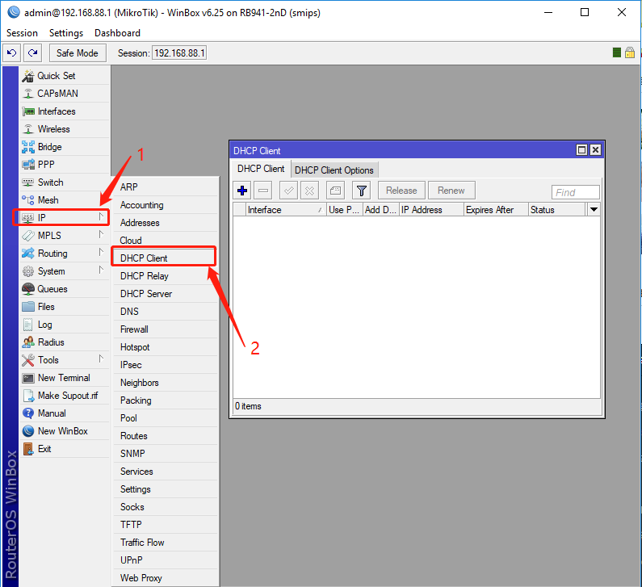
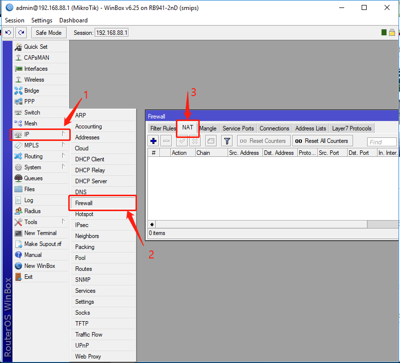
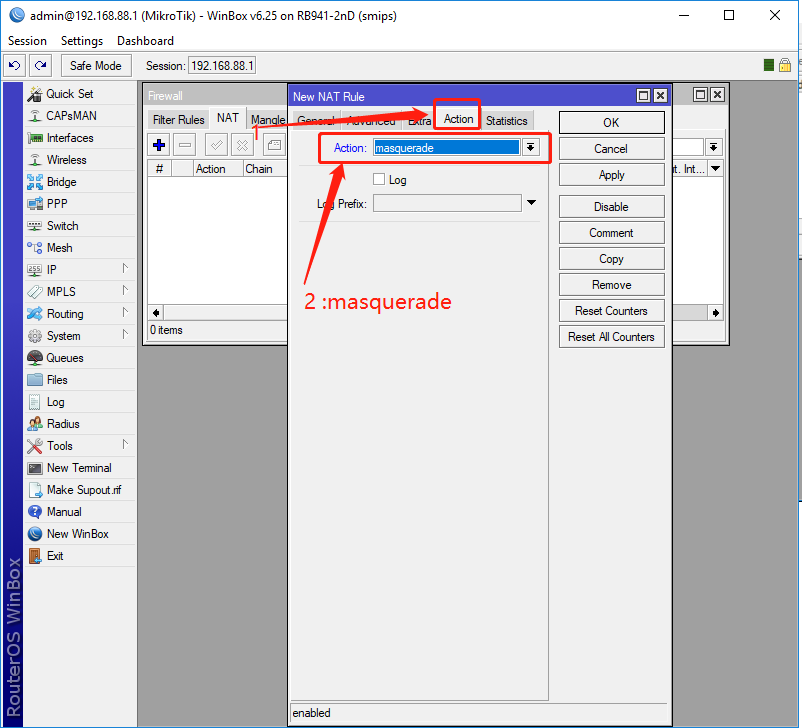

###Connect to Internet

1.1 Open DHCP Client Page

Steps： IP  ->  DHCP Client

1.2 Create DHCP Client

###Setting NAT 

1.3 Open Firewall NAT Page

Steps： IP   -->  Firewall  --> NAT

1.4 Create NAT rule to masquerde address

