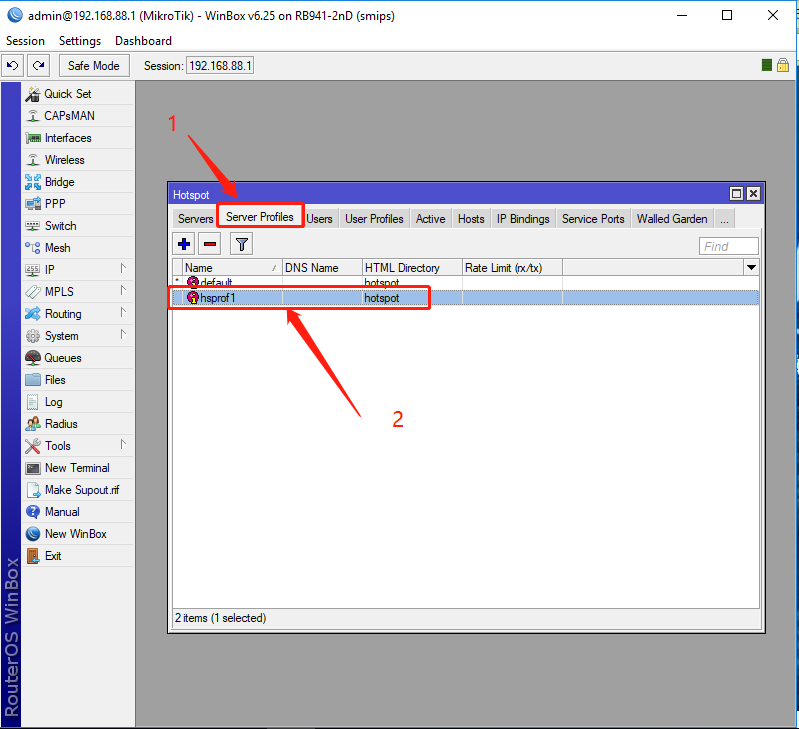
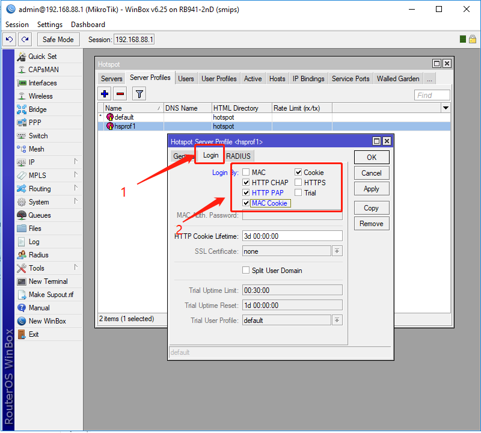
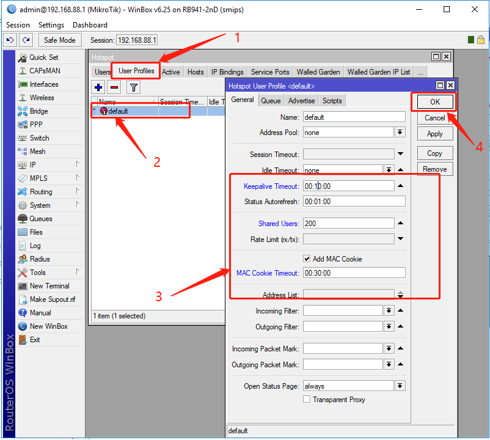
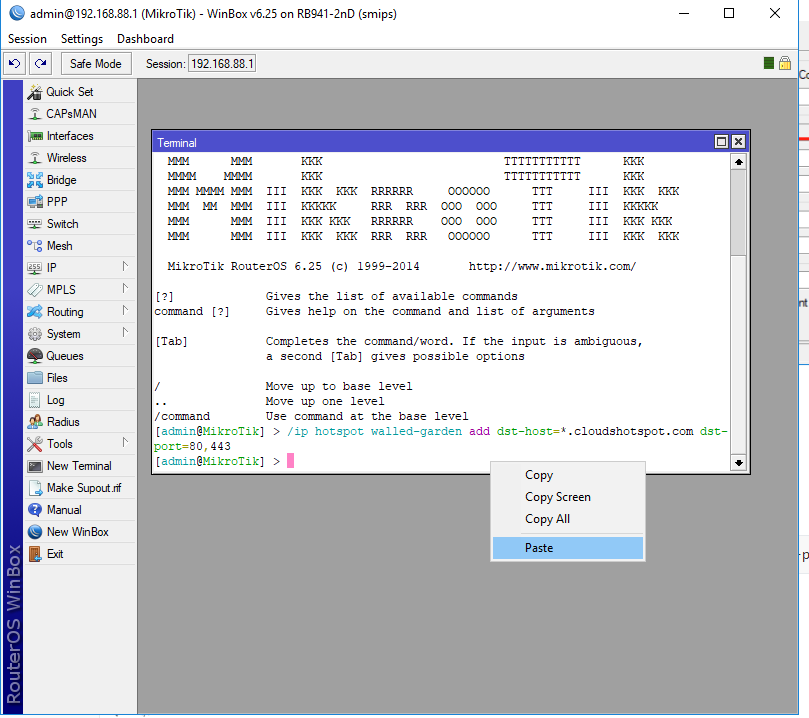

###Setting Hotspot Profile

1.1 Open server Profile page



1.2 Set Hotspot Server Profile

**Tips： Enable  HTTP PAP,MAC Cookie



###Setting Users & Users Profile


1.3 Set User(Change Username or password)


1.4 Set User Profile

** Shared users Set empty or the number you should set




###Setting Cloud Hotspot Profile


1.5 Set Walled-Garden Code（Require）

Please Copy the code below

```
/ip hotspot walled-garden add dst-host=*.cloudshotspot.com dst-port=80,443
```

1.6 Terminal code 

Please paste the code that you have copyed



