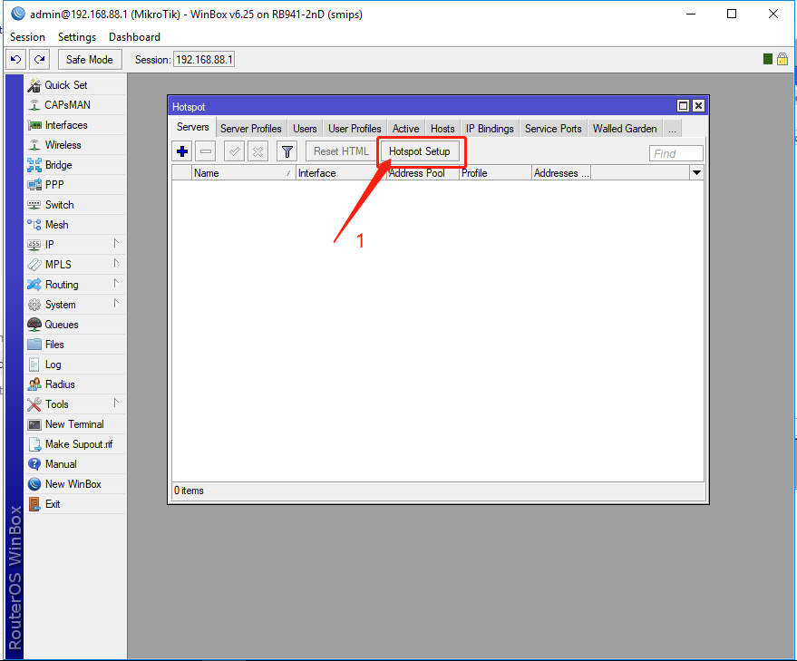
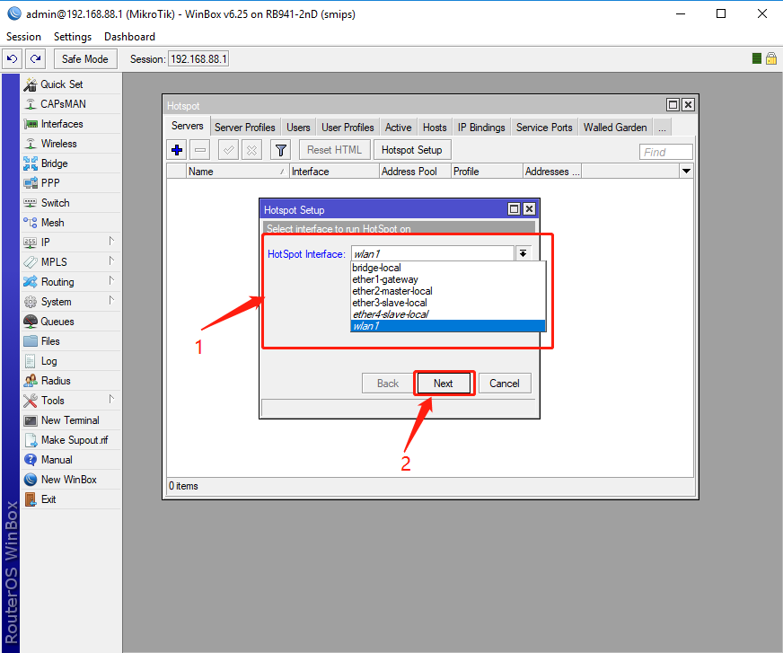

### Create Hotspot Server

1.1 Open Hotspot Server Page

Steps： IP  --->    Hotspot    ---> Servers

1.2 Hotspot Setup to generate a server

Steps：  Hotspot  Setup

1.3 Select Interface for Hotspot

1.4 Select IP for Hotspot

1.5 Select IP pools for Hotspot

 

1.6 Select Hotspot SSL certificate

1.7 Select SMTP Server

1.8 Select DNS Server

1.9 Select DNS name

1.10 Configure Hotspot Account

`*** Very Important` The username and password here as some as you have entered on "Create Site" Page

1.11 Done

