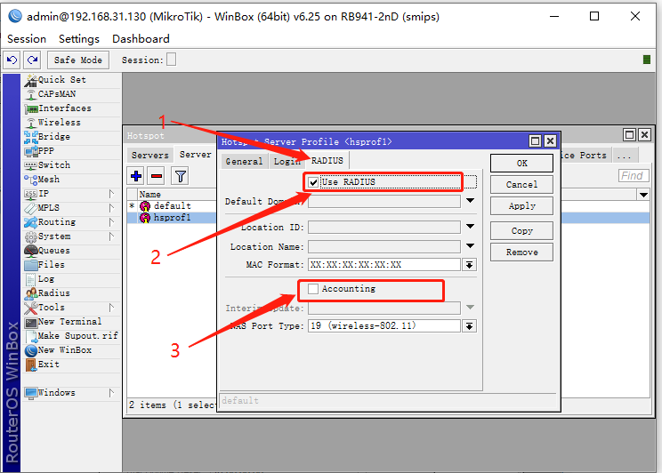

##Mikrotik RouterOS Radius AAA authentication
###Setting Hotspot Profile Properties

1.1 Open the Hotspot server Profile page


1.2  Setting Hotspot Server Profile Properties

**提示：Turn on HTTP PAP, MAC Cookies


###Set Hotspot Radius AAA Authorization Authentication


1.3 Set the use of Radius, check to enable. Note, please uncheck the Accounting




1.4 Set up Radius server


### Applying Cloud Hotspot Property Codes


1.5 Set Walled-Garden release code (required)

Please copy the code below

```
/ip hotspot walled-garden add dst-host=*.cloudshotspot.com dst-port=80,443
```

1.6 Configure Terminal code

Please paste the copied code


