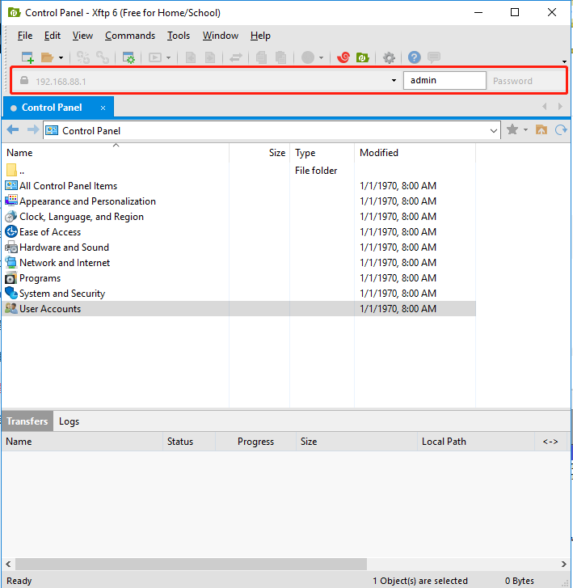
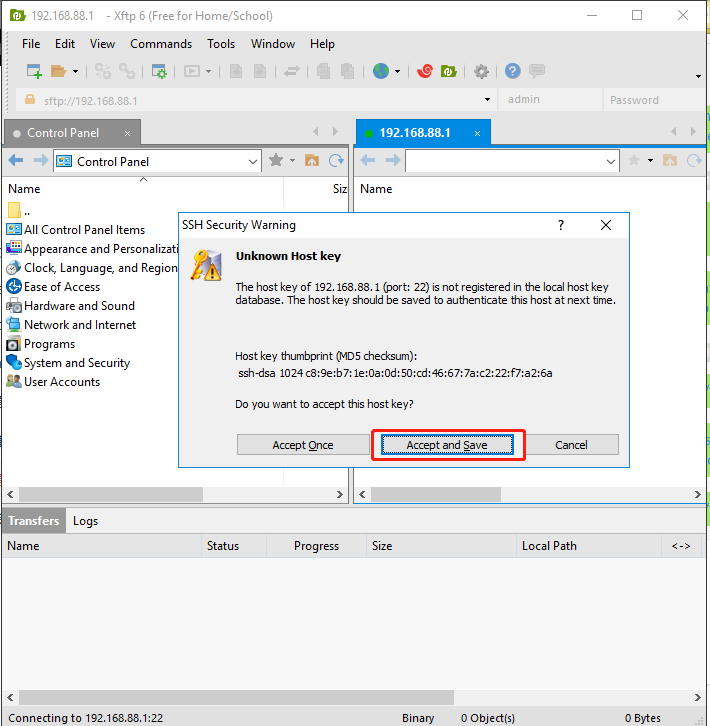
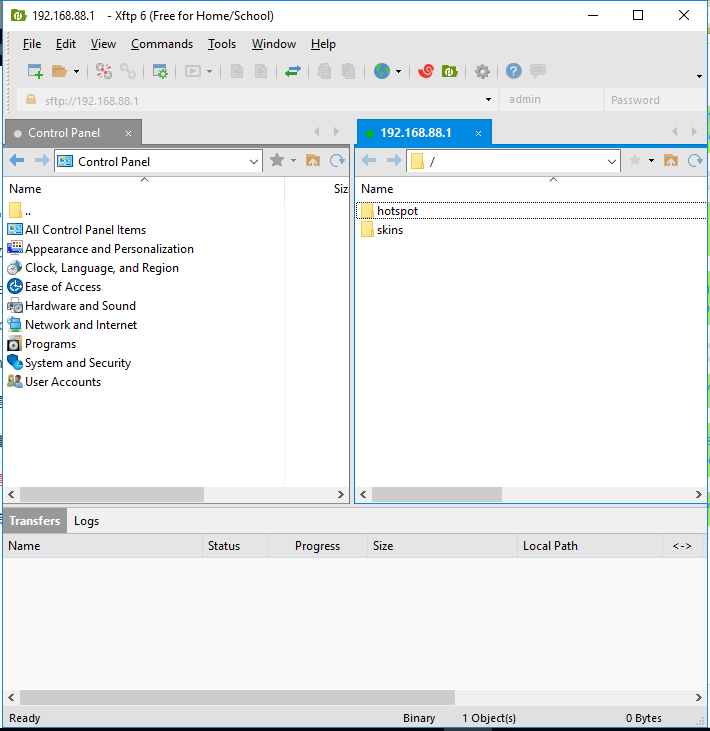
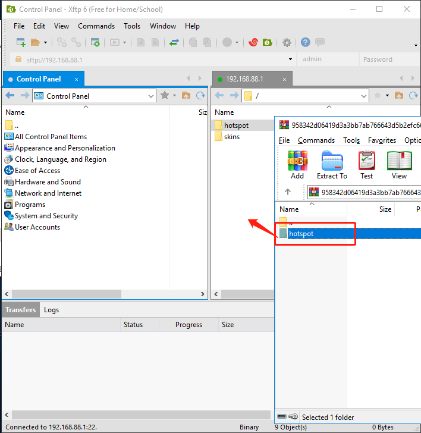
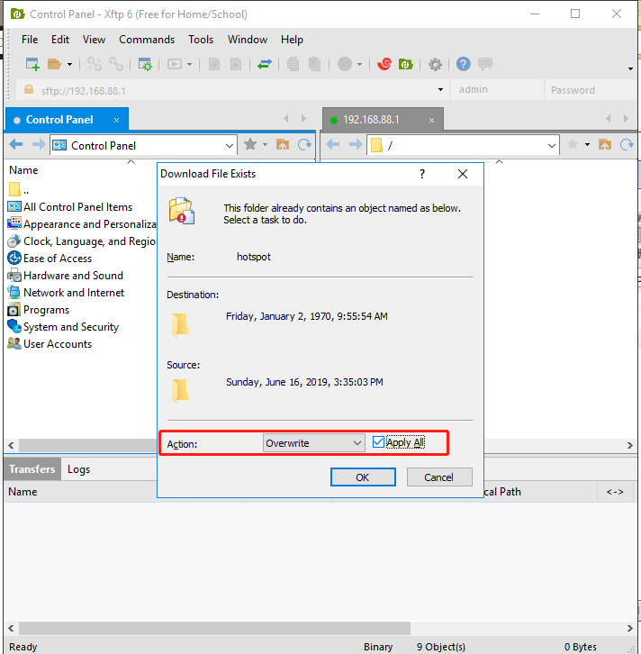
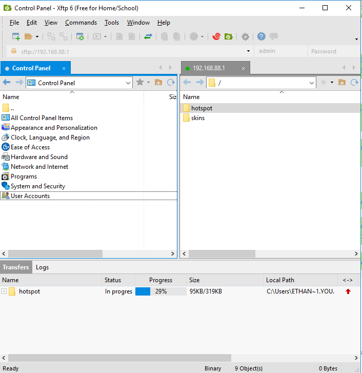

###FTP to Upload Site file

1.1 Open xftp tools and type the IP to connect to RouterOS

1.2 Connect to RouterOS successfully

1.3 Upload the Hotspot zip file to RouterOS

1.4  Overwrite the exists Hotspot directory

