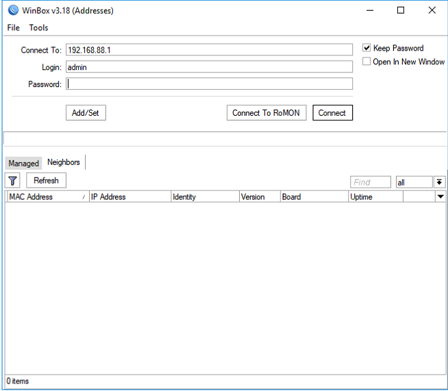
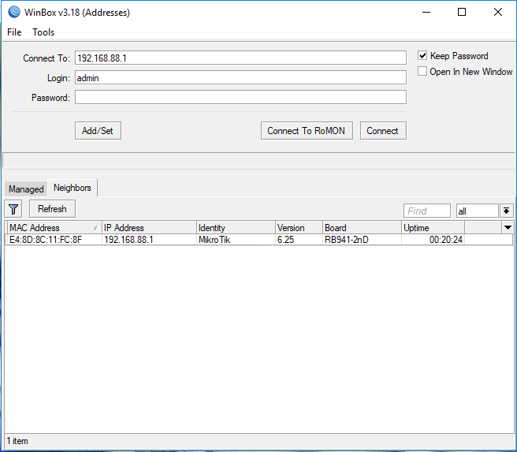
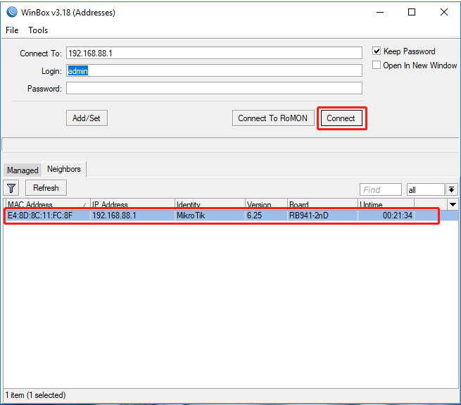
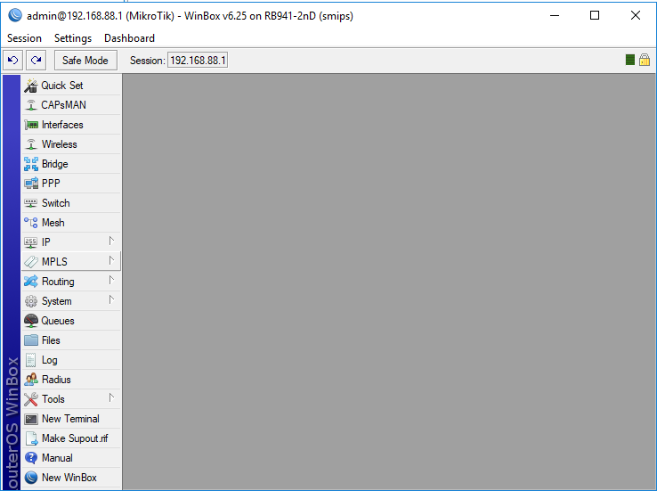

 ### Connect to RouterOS
 1.1 First download Winbox
	https://download.mikrotik.com/routeros/winbox/3.18/winbox.exe

Then open Winbox software：
 

1.2 Search devices

1.3 Connect to device

1.4 Winbox Dashboard
