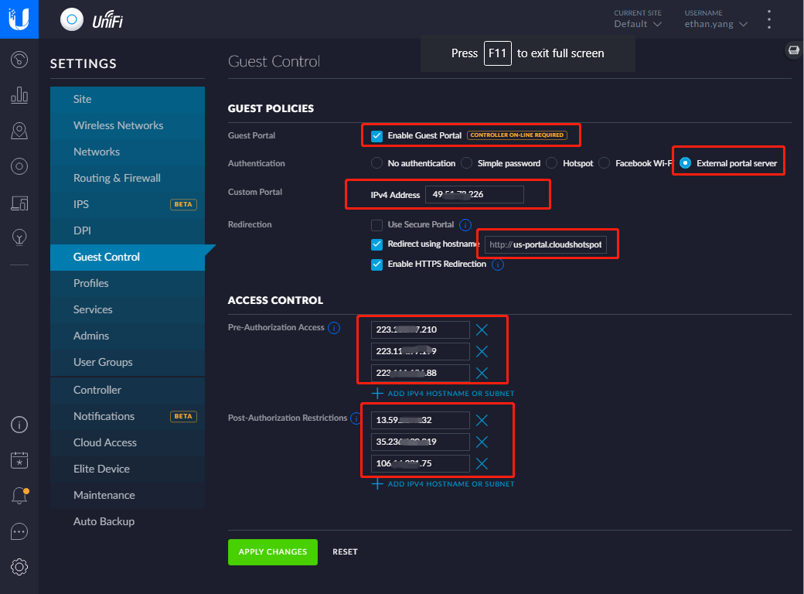

###Unifi Guest Portal

1.1 Configure Guest Control

**Tips:** 

**GUEST POLICIES**

*. Enable "External portal server" options

*. Custom Portal   ->   IPv4 Address : Provided by Created Site page

*. Redirection   ->   Redirect using hostname: Provided by Created Site page

**ACCESS CONTROL**

*. Pre-Authorization Access   ->   IPV4 Hostname : Provided by Created Site page

*. Post-Authorization Restrictions --> IPV4 Hostname : Provided by Created Site page

