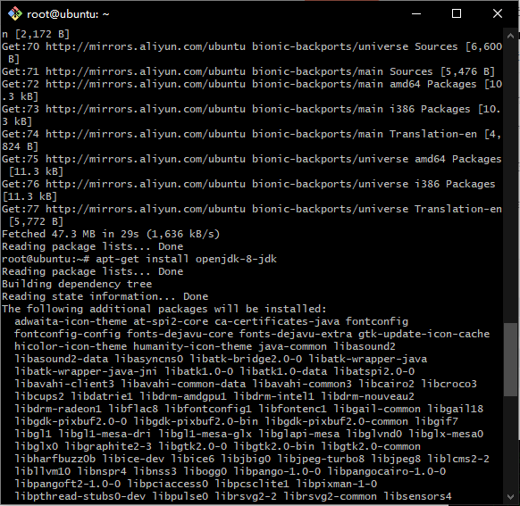
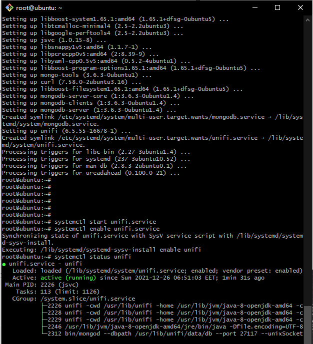

#Ubuntu 18.04.6 LTS 安装Unifi Controller

1.1 用SSH工具以root管理员身份登录到服务器


1.2 更新atp软件源

```shell
apt-get upadte
```


```shell
apt-get install openjdk-8-jdk
```




3.2 检测Java安装版本信息
```shell 
 java -version

```


下载unifi controller 6.5.55

到 https://www.ui.com/download/unifi/ 下载最新Linux版UniFi控制器
 
```shell 
 wget https://dl.ui.com/unifi/6.5.55/unifi_sysvinit_all.deb --no-check-certificate

```


```shell

 dpkg -i unifi_sysvinit_all.deb

```
 由于Ubuntu系统是第一次安装Unifi controller软件服务,开始安装可能会缺少部分依赖，导致安装失败如下图;

```shell
dpkg: error processing package unifi (--install):
dependency problems - leaving unconfigured
Processing triggers for ureadahead (0.100.0-21) ...
Processing triggers for systemd (237-3ubuntu10.52) ...
Errors were encountered while processing:
unifi
```
解决以上问题需执行以下命令，将依赖补充完整，再执行一次安装

```shell
 apt-get install -f

```


5. 启动  
 ```shell 
systemctl enable unifi.service #添加到开机启动 
systemctl start unifi.service 
systemctl status unifi 
```




  

6. 如果云服务器是阿里云或腾讯云提供的,请在管理平台添加防火墙规则，把3478,8080,8443,8843,8880添加到规则内放行端口即可。


7. 在浏览器打开https://IP:8443
 


