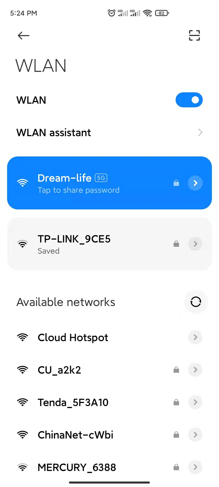
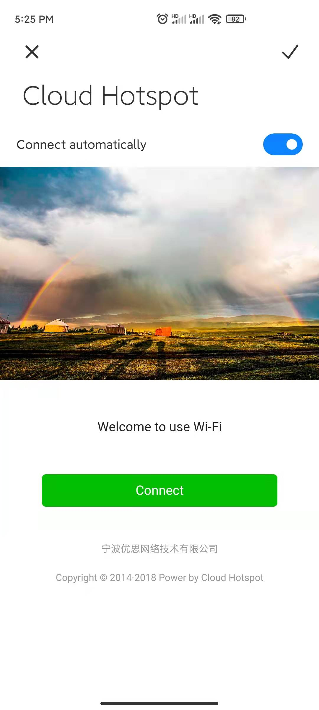

#Unifi Controller configure Cloud Hotspot

 ##Administrator sign in to Unifi Controller,Overview page：

 
 
The latest version Unifi controller Network Version 6.5.54

 
This document briefly describes the integrating between Guest Hotspot and Cloud Hotspot, which provide SMS verification of mobile phone number, member account login, Voucher digital verification code, and one-click connection to  public Free Wi-Fi. 

##1 Unifi Controller set Guest Hotspot

##1.1 Enter the setting page
 Steps: Click -->Settings

 

##1.2 Add a new Guest Portal
 Steps: Click -->Add New Guest Hotspot

 

##2.2 Configure Guest Portal

Enable Hotspot:
 
Hotspot status: select to open

 Name:
 
 Wireless Wi-Fi name: Enter the SSID of the wireless network you want, for example: Cloud Hotspot

 Authentication Type:

 Wireless authentication method: select External Portal Server
 

 

 
##2.3 Setting up External Portal Server
External Portal：

The IP address is provided by the management console,[please refer to this document](../cloud-hotspot/create-a-site-with-unifi-controller.md) 

 

##2.4 Steps: Click the Advanced button -->Advanced --->Portal Configuration

Steps: Click the Advanced button -->Advanced --->Portal Configuration

Secure Portal:Enable

Redirect Using Hostname：

Provided by Cloud Hotspot management platform, [please refer to this document](../cloud-hotspot/create-a-site-with-unifi-controller.md)
 

Example: cn-portal.cloudshotspot.com

示列：us-portal.cloudshotspot.com

 

##2.5 Set up Network Isolation
Set up network isolation to connect with cloud hotspots

Allowed Authorization Access：

There are multiple parameters provided by the management platform,[please refer to this document](../cloud-hotspot/create-a-site-with-unifi-controller.md)

##2.6 Save and apply Apply Changes
Steps: Apply Changes

 

##2.7 Check Wi-Fi on mobile phone

  
##2.8 Connect Wi-Fi to Cloud Hotspot
 
