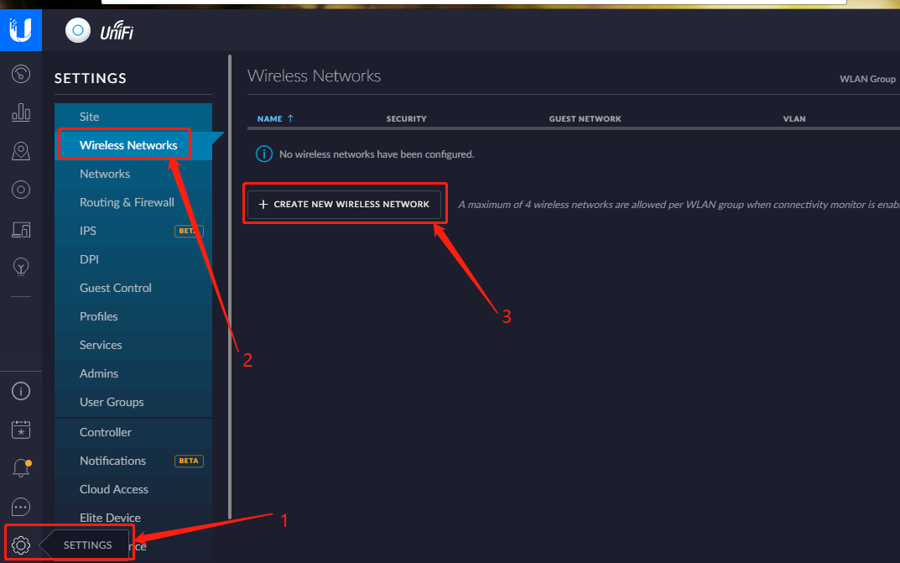
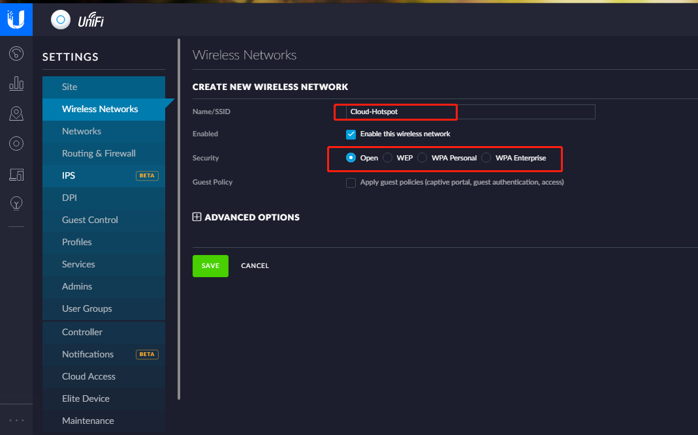

###Unifi Controller Wireless Network

1.1 Create Wireless Network

Steps： Settings   -->    Wireless Networks   -->   Create New Wireless Network

1.2  Configure Wireless Network

**Tips: Enter your network SSID & Enable "Open"  Security options

