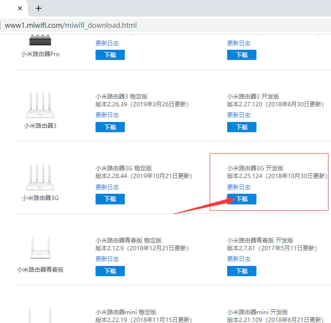
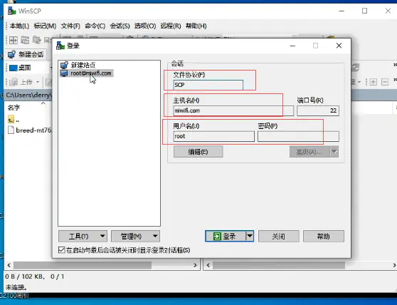

# 小米R3G硬件配置

处理器：MT7621A MIPS 双核880MHz

DRAM内存: 256MB DDR3-1200

Flash闪存:128MB SLC Nand Flash

wifi芯片：7612EN和7603EN

接口：1个USB 2.0接口

无线速率：2.4G:300Mbps,5G:867Mbps

##R3G路由器刷机主要流程：

	1. 升级小米路由器官方的开发版本固件

	2. 进入官网下载ssh工具包

	3. 准备u盘，将工具包拷贝到u盘根目录

	4. 通过u盘中的工具包开启ssh服务

	5. ssh登录R3G路由器后台

	6. 下载Cloud-Hotspot系统固件，刷入安装到路由器

 

##升级开发固件

###一. 用一台电脑连接R3G路由器，保证电脑与路由器互通

###二. 打开浏览器输入路由器的域名miwifi.com或者路由器的ip地址，进入管理界面。

 

###三. 进入小米路由器官网下载R3G的开发版固件

[http://www1.miwifi.com/miwifi_download.html](https://links.jianshu.com/go?to=http%3A%2F%2Fwww1.miwifi.com%2Fmiwifi_download.html)

###四. 在路由器管理界面中点击系统升级，进入升级界面，然后选择下载的固件进行升级

###五.下载ssh工具包

升级开发版本固件后ssh服务是关闭的，需要去小米官网下载ssh工具包

打开小米官网进入开平台中心

[http://www1.miwifi.com/miwifi_open.html](https://links.jianshu.com/go?to=http%3A%2F%2Fwww1.miwifi.com%2Fmiwifi_open.html)

用绑定小米路由器的小米账号登录

这里需要登录绑定了小米路由器的小米账号，登录后可以查看自己的路由器的ssh root密码，这个页面也有开启ssh的详细步骤，可以按照步骤一步步操作

点击下载工具包

	1. 请将下载的工具包bin文件复制到U盘（FAT/FAT32格式）的根目录下，保证文件名为miwifi_ssh.bin；

	2. 断开小米路由器的电源，将U盘插入USB接口；

	3. 按住reset按钮之后重新接入电源，指示灯变为黄色闪烁状态即可松开reset键；

	4. 等待3-5秒后安装完成之后，小米路由器会自动重启，之后您就可以尽情折腾啦 ：）

###六.刷入Cloud-Hotspot系统固件

现在路由器已经开启了ssh服务，我们需要用ssh连接到路由器，这里我们采用xshell工具

输入ssh [root@miwifi.com](https://links.jianshu.com/go?to=mailto%3Aroot%40miwifi.com)  // 如果知道路由器的ip地址，如192.168.31.1也可以输入

ssh root@192.168.31.1 密码是上个步骤中小米开发者中心显示的root密码

打开winscp工具，上传Cloud-Hotspot系统固件到到路由器
  

 

回到路由器ssh终端， 安装固件

	mtd write cloud-hotspot-xiaomi_mi-router-3g-squashfs-kernel1.bin kernel1

	mtd write cloud-hotspot-xiaomi_mi-router-3g-squashfs-rootfs0.bin rootfs0
	 
	nvram set flag_try_sys1_failed=1

	nvram commit

固件升级(已经安装OpenWRT的路由器):
	
	sysupgreade -n cloud-hotspot-xiaomi_mi-router-3g-squashfs-sysupgrade.bin

 