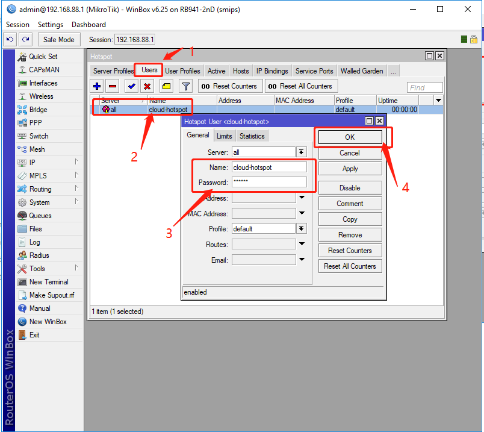
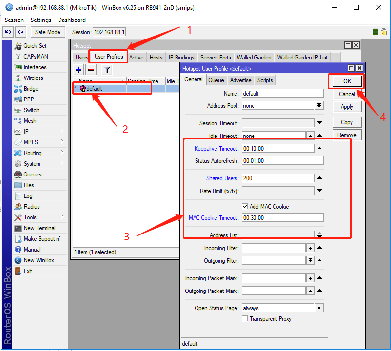

###设置Hotspot Profile 属性

1.1 打开 Hotspot  server Profile 界面


1.2 设置Hotspot Server Profile属性

**提示：打开HTTP PAP,MAC Cookie


###设置 Hotspot用户及用户属性


1.3设置用户(修改用户名或密码)



1.4设置Hotspot User Profile

** Shared users 为空或者具体想要的数字




###配置Cloud Hotspot 属性代码


1.5 设置Walled-Garden 放行代码（必需）

请复制以下代码

```
/ip hotspot walled-garden add dst-host=*.cloudshotspot.com dst-port=80,443
```

1.6 配置Terminal终端代码 

请将复制的代码粘贴


