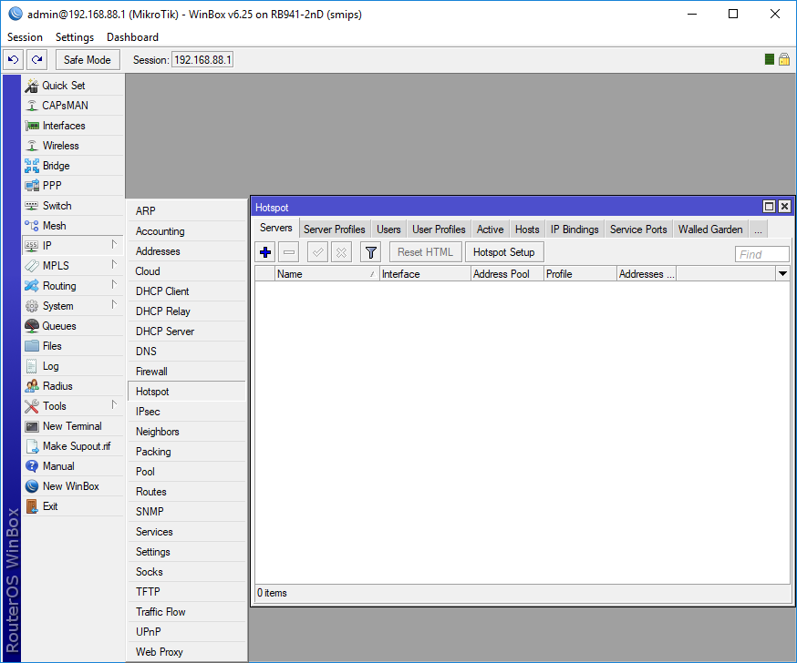
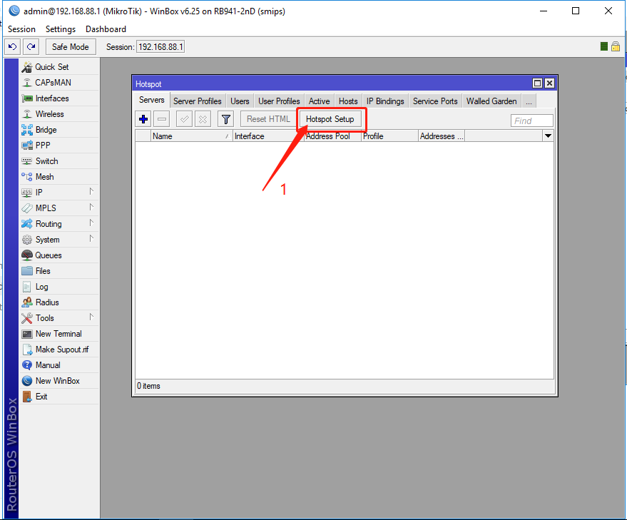
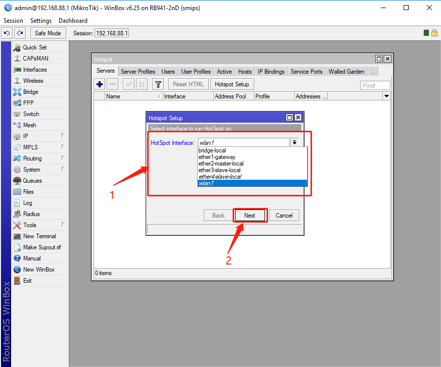
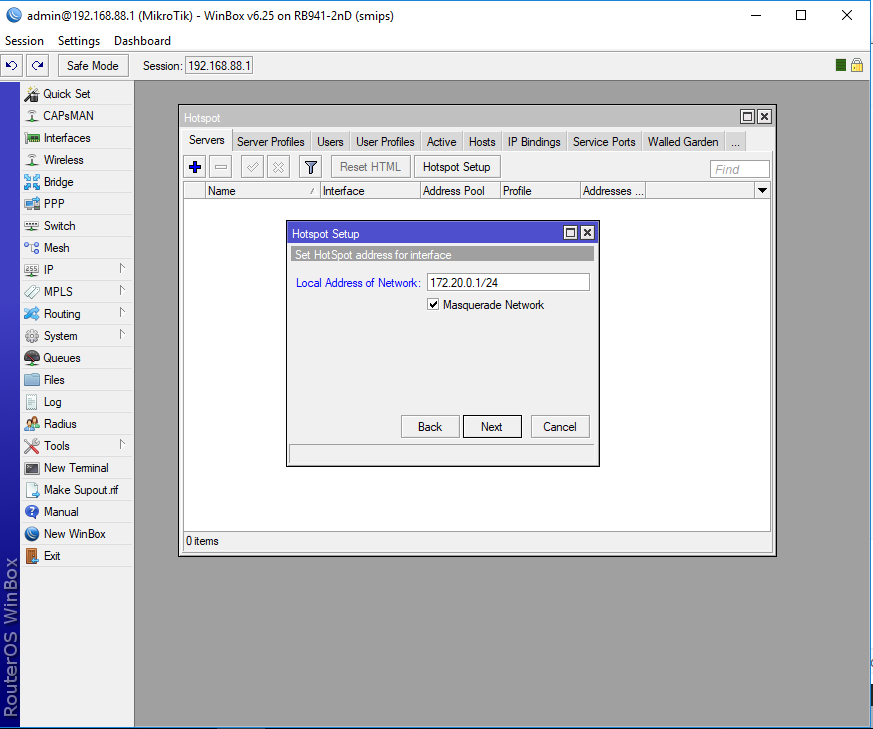
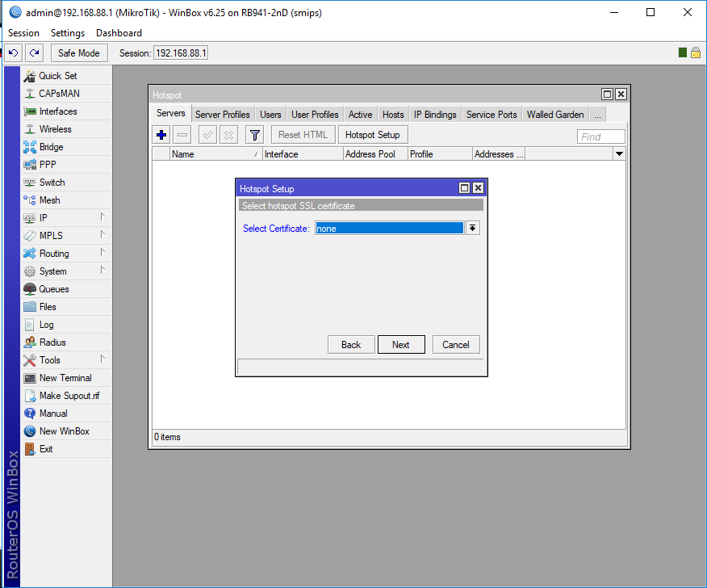
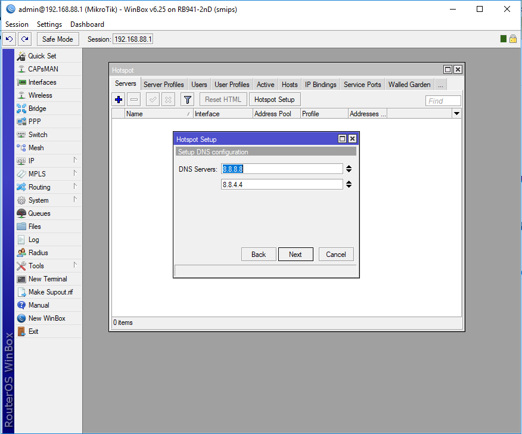
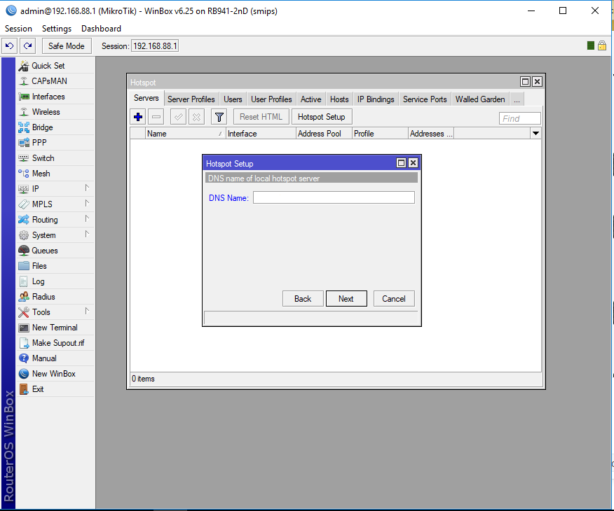
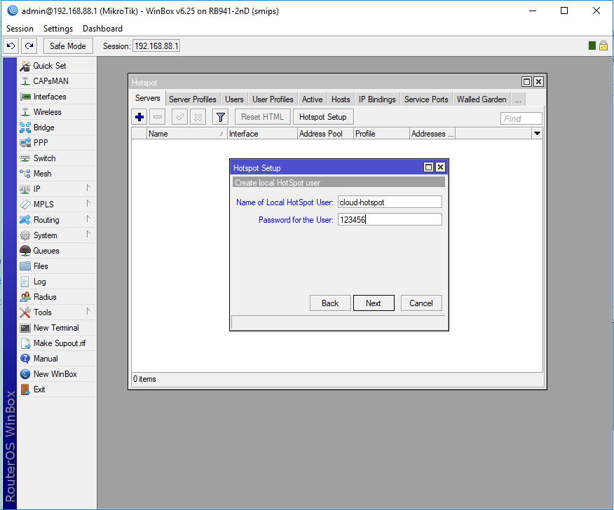

### 创建Hotspot热点服务

1.1 打开Hotspot Server管理界面

步骤： IP  --->    Hotspot    ---> Servers

1.2 使用Hotspot Setup 创建Hotspot 服务

步骤：Hotspot   Setup

1.3选择Hotspot服务接口

1.4 设置接口IP地址

1.5 设置IP地址池

 

1.6 选择Hotspot SSL 证书

1.7 设置SMTP 服务

1.8 设置DNS 服务解析地址

1.9 设置DNS 名称

1.10 设置Hotspot服务用户信息

`*** 重要` 这里的用户名与密码与在创建站点时输入的是一致的

1.11 创建完成

