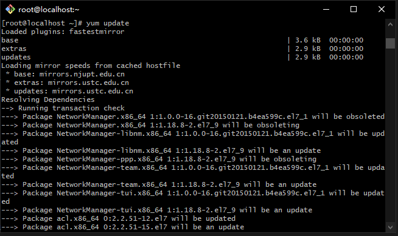
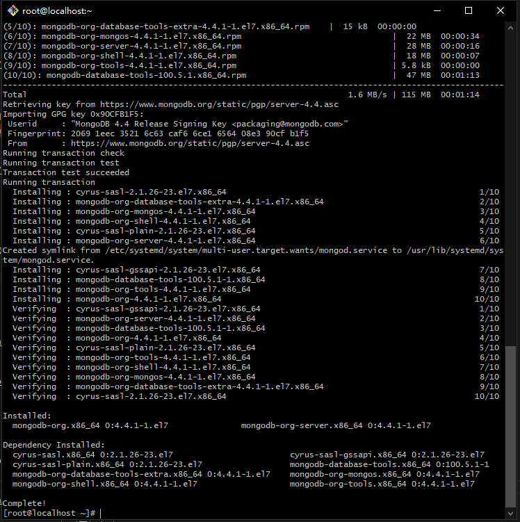
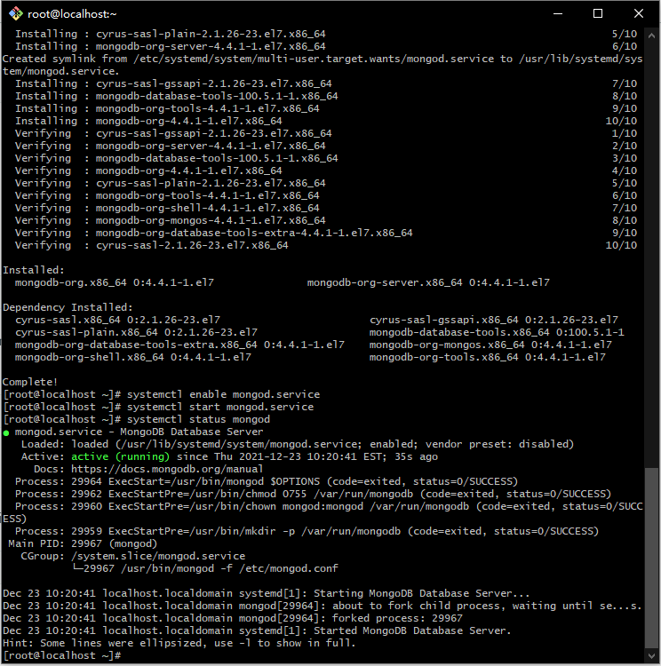

 ###CentOS 7 安装 Unifi Controller 最新版本


1.1 用SSH工具以root管理员身份登录到服务器


1.2 更新yum软件源

```shell
yum upadte
```


1.3 关闭服务器防火墙
```shell
systemctl stop firewalld.service 
systemctl disable firewalld.service

```


2.1 添加mongodb软件源

 ```shell
vi /etc/yum.repos.d/mongodb-org-4.4.repo
```
添加以下内容到mongodb-org.repo

 ```shell
[mongodb-org-4.4]
name=MongoDB Repository
baseurl=https://repo.mongodb.org/yum/redhat/$releasever/mongodb-org/4.4/x86_64/
gpgcheck=1
enabled=1
gpgkey=https://www.mongodb.org/static/pgp/server-4.4.asc

```
 
2.2 安装mongodb-org
```shell
yum install -y mongodb-org-4.4.1 mongodb-org-server-4.4.1

```



2.3 设置Mongodb开机启动,并立即运行mongodb服务,检测其状态
```shell
systemctl enable mongod.service #添加到开机启动 
systemctl start mongod.service #启动mongod
systemctl status mongod  #查看mongod运行状态

```


3.1 安装JAVA JDK环境
```shell 
 yum install -y java-1.8.0-openjdk

```


3.2 检测Java安装版本信息
```shell 
 java -version

```


4.1 安装UniFi Controller


准备工作：先安装好wget下载工具,xz解压工具
```shell 
yum install xz wget

```

 


下载unifi controller 6.5.55

到 https://www.ui.com/download/unifi/ 下载最新Linux版UniFi控制器
```shell 
 wget https://dl.ui.com/unifi/6.5.55/unifi_sysvinit_all.deb --no-check-certificate

```

解压文件
```shell 
mkdir tools
ar -xv unifi_sysvinit_all.deb &&  tar -vxf data.tar.xz

cp -fr usr/lib/unifi /usr/local/

cd /usr/local/unifi/bin && ln -fs /usr/bin/mongod mongod #创建链接 
```

https://dl.ui.com/unifi/6.5.55/unifi_sysvinit_all.deb

用解压软件打开，360RAR之类的软件打开，然后把unifi目录从unifi_sysvinit_all\usr\lib\提取出来
把文件上传到 /usr/local/ 目录

#编辑unifi系统服务
```shell 
vi /etc/systemd/system/unifi.service 
```
添加以下内容到unifi.service
```shell 
[Unit]
Description=UniFi AP Web Controller
After=syslog.target network.target
[Service]
Type=simple
User=root
ExecStart=/usr/bin/java -Xmx1024M -jar /usr/local/unifi/lib/ace.jar start
ExecStop=/usr/bin/java -jar /usr/local/unifi/lib/ace.jar stop
SuccessExitStatus=143
[Install]
WantedBy=multi-user.target
```
5. 启动  
 ```shell 
systemctl enable unifi.service #添加到开机启动 
systemctl start unifi.service 
systemctl status unifi 
```
6. 到腾讯云后台添加防火墙规则，把3478,8080,8443,8843,8880添加到规则内放行端口。


7. 在网页打开https://IP:8443