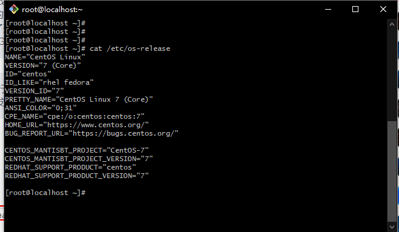
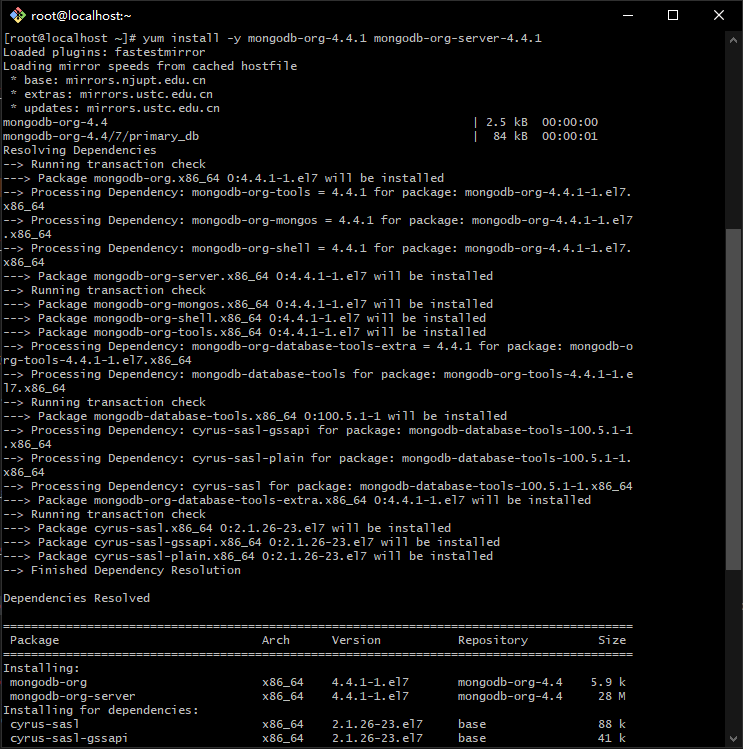
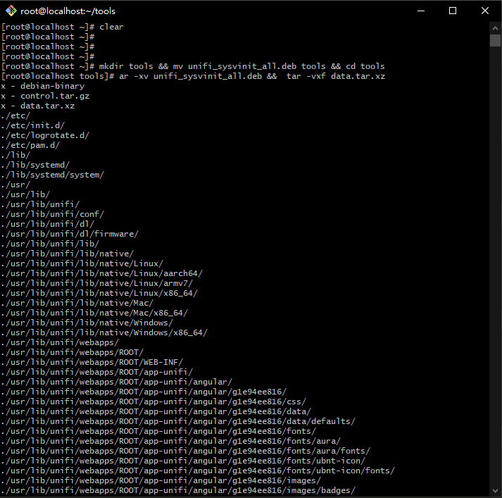
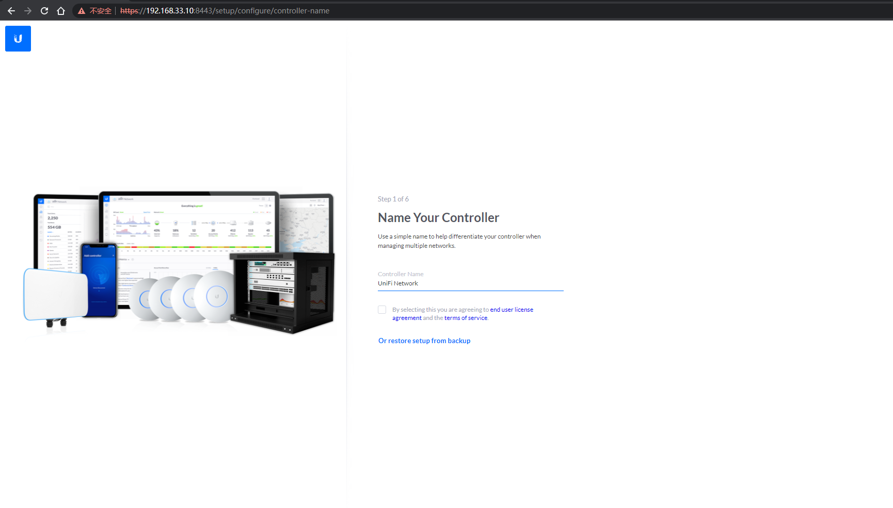

#CentOS 7 install Unifi Controller 6.5.55 
 

##1.1 Use SSH client tool to log in to the server as the root administrator




##1.2 Update yum software source

```shell
yum upadte
```


##1.3 Turn off the server firewall
```shell
systemctl stop firewalld.service 
systemctl disable firewalld.service

```


##2.1 Add mongodb software source

 ```shell
vi /etc/yum.repos.d/mongodb-org-4.4.repo
```
添加以下内容到mongodb-org.repo

 ```shell
[mongodb-org-4.4]
name=MongoDB Repository
baseurl=https://repo.mongodb.org/yum/redhat/$releasever/mongodb-org/4.4/x86_64/
gpgcheck=1
enabled=1
gpgkey=https://www.mongodb.org/static/pgp/server-4.4.asc

```
 
##2.2 Install mongodb-4.4
```shell
yum install -y mongodb-org-4.4.1 mongodb-org-server-4.4.1

```



##2.3 Setup Mongodb 
Configure Mongodb services to start automatically at boot.and immediately run the mongodb service and then check its status

```shell
systemctl enable mongod.service  
systemctl start mongod.service  
systemctl status mongod  

```


##3.1 Install JAVA JDK environment
```shell 
 yum install -y java-1.8.0-openjdk

```


##3.2 Checking the JAVA version information
```shell 
 java -version

```


##4.1 Install UniFi Controller


Preparation: first install wget download tool, xz decompression tool
```shell 
yum install xz wget

```

 


##4.2 Download Unifi controller 6.5.55 Version

Go to https://www.ui.com/download/unifi/ to download the latest Linux version of UniFi controller
https://dl.ui.com/unifi/6.5.55/unifi_sysvinit_all.deb
 
```shell 
 wget https://dl.ui.com/unifi/6.5.55/unifi_sysvinit_all.deb --no-check-certificate

```


##4.3 Unzip the file and configure and install the Unifi controller service

```shell 
mkdir tools && mv unifi_sysvinit_all.deb tools && cd tools
ar -xv unifi_sysvinit_all.deb &&  tar -vxf data.tar.xz

cp -fr usr/lib/unifi /usr/local/

cd /usr/local/unifi/bin && ln -fs /usr/bin/mongod mongod  
```




##4.4 Edit Unifi Controller system service
```shell 
vi /etc/systemd/system/unifi.service 
```
Add the following to unifi.service

```shell 
[Unit]
Description=UniFi AP Web Controller
After=syslog.target network.target
[Service]
Type=simple
User=root
ExecStart=/usr/bin/java -Xmx1024M -jar /usr/local/unifi/lib/ace.jar start
ExecStop=/usr/bin/java -jar /usr/local/unifi/lib/ace.jar stop
SuccessExitStatus=143
[Install]
WantedBy=multi-user.target
```
Note: -Xmx1024M is to limit the maximum memory to 1GB (1024MB), if the server memory is very large, it is good to delete this proerty configuration


##4.5. Start Unifi Controller service
 ```shell 
systemctl enable unifi.service  
systemctl start unifi.service 
systemctl status unifi 
```


 
If the cloud server is provided by Alibaba Cloud or Tencent Cloud, please add firewall rules on the management platform, and add 3478,8080,8443,8843,8880 to the allowed ports in the rules.


##4.6  Access to Unifi Controller service
Open https://IP:8443 in the browser
 


