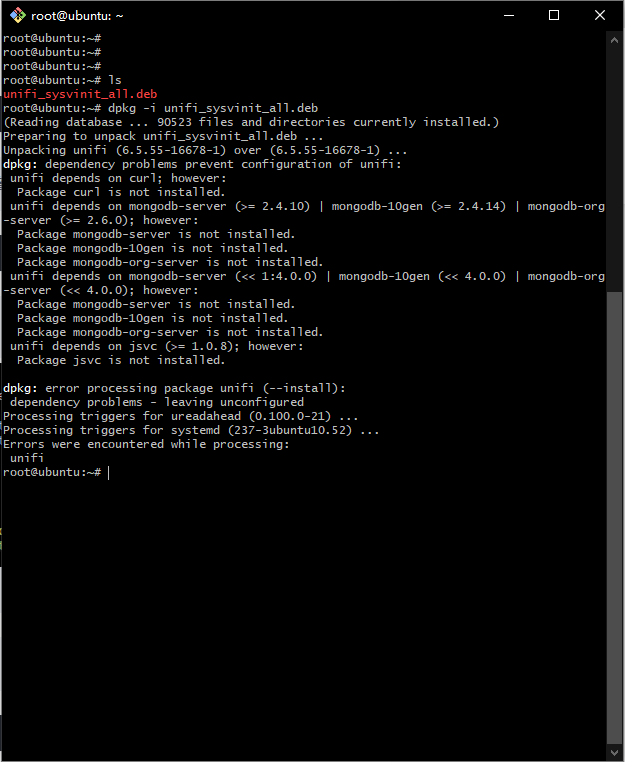
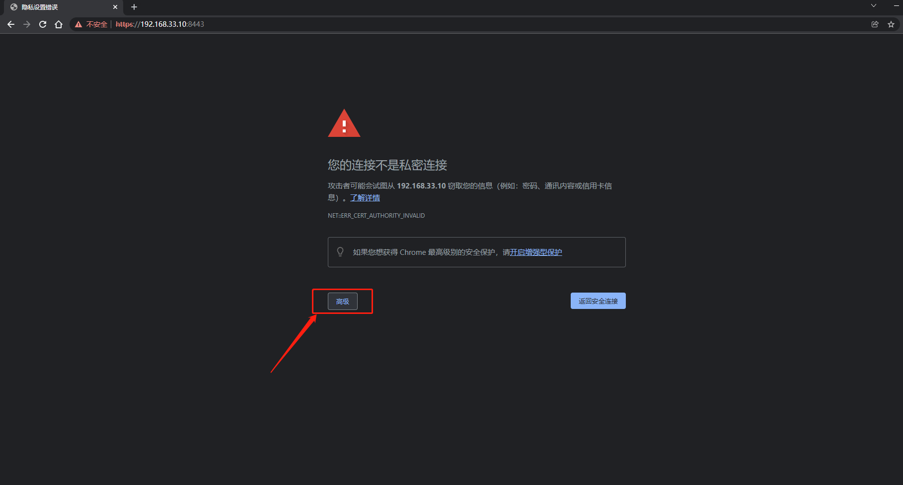

#Install Unifi Controller on Ubuntu 18.04.6 LTS

##1.1 Use SSH client tool to log in to the server 
Change the user as the root administrator

```shell
sudo su -
```


##1.2 Update APT-get software source

```shell
apt-get upadte
```


##2.1 Install JAVA JDK8

```shell
apt-get install openjdk-8-jdk
```


##2.2 Checking the Java version information
```shell 
 java -version

```


##3.1 Download unifi controller 6.5.55

Go to https://www.ui.com/download/unifi/ to download the latest Linux version of UniFi controller
 
```shell 
 wget https://dl.ui.com/unifi/6.5.55/unifi_sysvinit_all.deb --no-check-certificate

```


##3.2 Install Unifi Controller software package
```shell

 dpkg -i unifi_sysvinit_all.deb

```
 Since the Ubuntu system is the first time to install the Unifi controller software service, some dependencies may be missing at the beginning of the installation,  installation to fail as shown below:
 
 

```shell
dpkg: error processing package unifi (--install):
dependency problems - leaving unconfigured
Processing triggers for ureadahead (0.100.0-21) ...
Processing triggers for systemd (237-3ubuntu10.52) ...
Errors were encountered while processing:
unifi
```
##3.3 Install Unifi Controller system dependent software installation package
 
To solve the above problems, you need to execute the following command, and complete the dependency, and then execute the installation again

```shell
 apt-get install -f

```


##3.4 Start Unifi Controller service
 ```shell 
systemctl enable unifi.service 
systemctl start unifi.service 
systemctl status unifi 
```


  

##4.1 Cloud server firewall rules
If the cloud server is provided by Alibaba Cloud or Tencent Cloud, please add firewall rules on the management platform, and add 3478,8080,8443,8843,8880 to the allowed ports in the rules.

##4.2 Access to Unifi Controller service

Open https://IP:8443 in the browser
 




