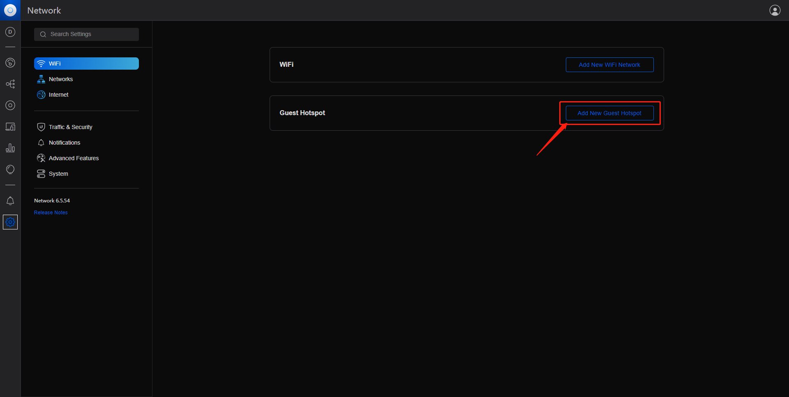
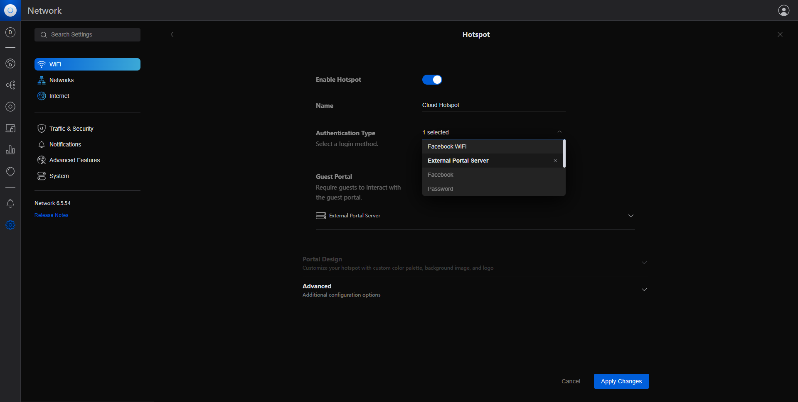
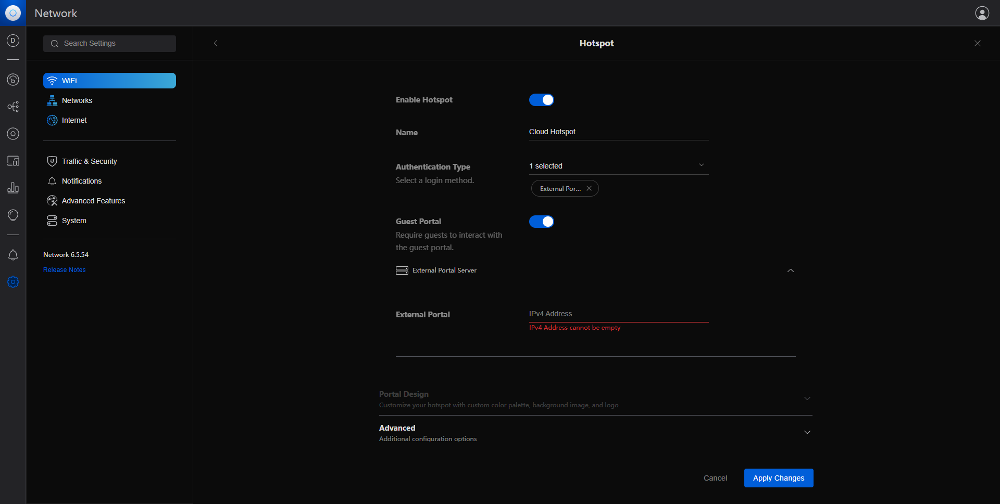
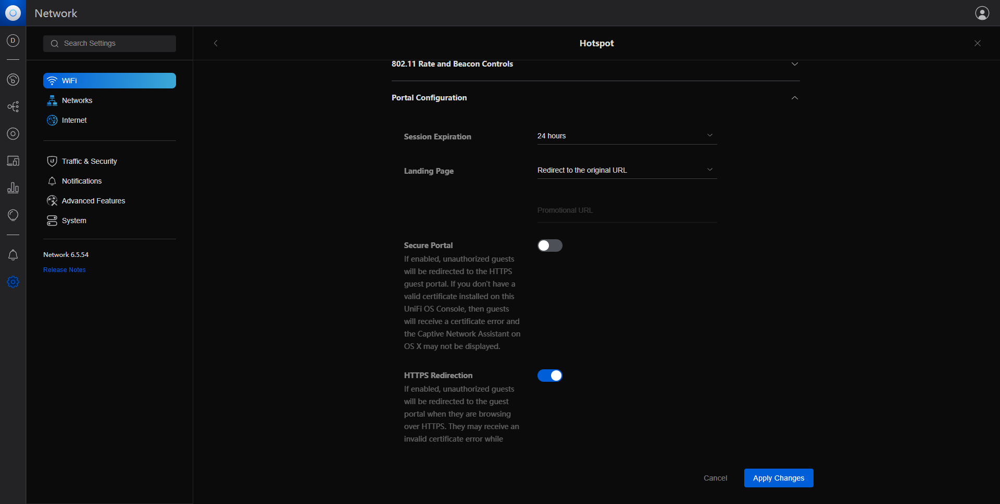
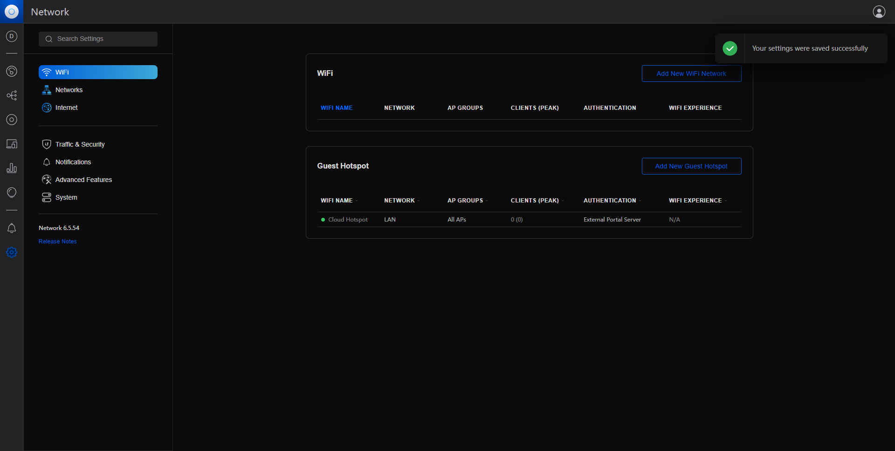

#Unifi Controller配置Cloud Hotspot

 ##管理员登录Unifi Controller控制管理界面,如下图：

 
 
 最新版本Unifi controller Network Version 6.5.54 
 
 本文档简单简述Guest Hotspot与云热点Cloud Hotspot进行对接,实现手机号码SMS短信验证,会员账号登录，Voucher数字验证码,一键连接免费 Free Wi-Fi的功能.

##1 Unifi Controller 设置Guest Hotspot

##1.1进入设置界面
  操作步骤: 
  点击-->Settings 

 

##1.2增加新的Guest Portal
 操作步骤: 
  点击-->Add New Guest Hotspot
 

##2.2 配置Guest Portal

Enable Hotspot:

热点状态:选择开启

 Name:
 无线Wi-Fi名称：输入自己想要的无线网络SSID，例:Cloud Hotspot

 Authentication Type:
 无线认证方式:选择 External Portal Server

 

 
##2.3 设置External Portal Server
External Portal：
IP地址由管理控制台提供,[请参考此文档](../cloud-hotspot/create-a-site-with-unifi-controller.md) 

 

##2.4 设置Portal Configuration

 操作步骤:
 点击高级按钮-->Advanced --->Portal Configuration

Secure Portal:开启

Redirect Using Hostname：

由云热点Cloud Hotspot管理平台提供,[请参考此文档](../cloud-hotspot/create-a-site-with-unifi-controller.md)

示列：cn-portal.cloudshotspot.com

 

##2.5 设置Network Isolation 
设置网络隔离与云热点进行对接

Allowed Authorization Access：

此处有多个参数由管理平台提供 

##2.6 保存并应用Apply Changes
 操作步骤:Apply Changes

 

##2.7 手机查看Wi-Fi

  
##2.8 连接Wi-Fi接入Cloud Hotspot
 
